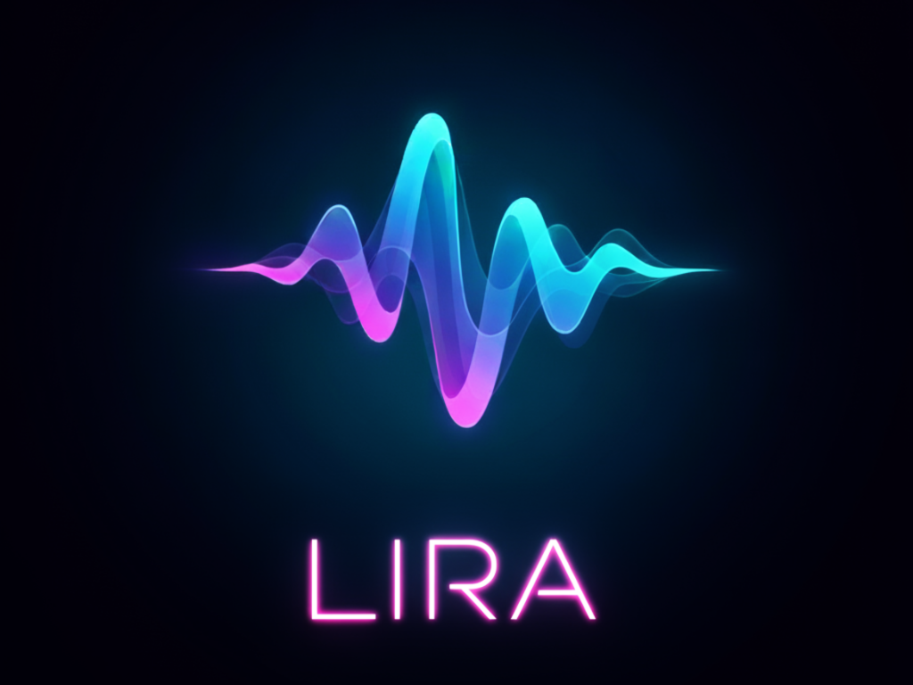

# LIRA: Local Inference tool for Realtime Audio
<p align="center">
    <p align="center">
        
    </p>

**Local, efficient speech recognition.  
Run ASR models on your machine—fast, simple, and developer-friendly.**

LIRA is a **CLI-first, developer-friendly tool**: run and serve ASR models locally with `lira run` and `lira serve` to integrate with your apps and tools.

---

## 🚀 Getting Started

**Prerequisites:**

- **Python 3.10** is required.
- We recommend using **conda** for environment management.
- For Ryzen™ AI NPU flow, follow the [Ryzen AI installation instructions](https://ryzenai.docs.amd.com/en/latest/inst.html) and verify drivers/runtime for your device. Ensure that you have a Ryzen AI 300 Series machine to nebale NPU use cases.
- Current recommended Ryzen AI Version: RAI 1.5.1 with 32.0.203.280 driver.

**Minimal install steps:**

1. **Clone the repo and change directory:**
    ```bash
    git clone https://github.com/aigdat/LIRA.git
    cd LIRA
    ```

2. **Activate your conda environment:**
    ```bash
    conda activate ryzen-ai-1.5.0
    ```

3. **Install LIRA in editable mode:**
    ```bash
    pip install -e .
    ```

Now you can run `lira --help` to see available commands.

---

## ⚡ CLI-first Design

LIRA is a CLI-first toolkit focused on simple developer workflows for exporting, running, and serving speech models.

**Primary commands:**

- **`lira run`**  
    Run, export, or benchmark models directly from the command line.  
    Use for local inference, ONNX export, or rapid prototyping.

- **`lira serve`**  
    Launch a FastAPI server with OpenAI-compatible endpoints.  
    Expose models as HTTP APIs for real-time transcription and seamless integration.  
    Add speech recognition to your apps, automate workflows, or build custom endpoints using standard REST calls.

**Quick examples:**
```bash
# Run a model locally (inference)
lira run whisper --model-type whisper-base --export --device cpu --audio audio_files/test.wav

# Serve the model for local apps (OpenAI-compatible endpoints)
lira serve --backend openai --model whisper-base --device cpu --host 0.0.0.0 --port 5000
```

---

## 🖥️ LIRA Server

LIRA includes a FastAPI-based HTTP server for rapid integration with your applications. The server offers **OpenAI API compatibility** for real-time speech recognition.

**Start the server:**

- **CPU acceleration:**
    ```bash
    lira serve --backend openai --model whisper-base --device cpu --host 0.0.0.0 --port 5000
    ```
- **NPU acceleration:**
    ```bash
    lira serve --backend openai --model whisper-base --device npu --host 0.0.0.0 --port 5000
    ```

> Interested in more server features?  
> Try the **LIRA server demo** with Open WebUI.  
> See [docs/OpenWebUI_README.md](docs/OpenWebUI_README.md) for setup instructions.

- Configure models via `config/model_config.json`.
- Set API keys (dummy) as environment variables for protected backends.

---

## 🏃 Running Models with `lira run`

To run a model using the CLI:
```bash
lira run <model> [options]
```
Replace `<model>` with the model name or path.

**Core flags:**
- `--device` — target device (`cpu`, `gpu`, `npu`)
- `-m` / `--model` — path to local exported model directory
- `--audio` — path to input audio file (wav)
- `--profile` — enable timing/profiling output

_Tip: run `lira run <model> --help` for model-specific flags._

---

### 🗣️ Running Whisper

Whisper supports export/optimization and model-specific flags.

**Example:**
```bash
# Export Whisper base model to ONNX, optimize and run on NPU
lira run whisper --model-type whisper-base --export --device npu --audio <input/.wav file> --use-kv-cache

# Run inference on a sample audio file
lira run whisper -m exported_models/whisper_base --device cpu --audio "audio_files/test.wav"
```

**Key Whisper flags:**
- `--model-type` — Hugging Face model id
- `--export` — export/prepare Whisper model to ONNX
- `--export-dir` — output path for export
- `--force` — overwrite existing export
- `--use-kv-cache` — enable KV-cache decoding
- `--static` — request static shapes during export
- `--opset` — ONNX opset version
- `--eval-dir` / `--results-dir` — run dataset evaluation

---

### 🔄 Running Zipformer

Zipformer enables streaming, low-latency transcription.

**Example:**
```bash
lira run zipformer -m <exported_model_dir> --device cpu --audio "audio_files/stream_sample.wav"
```

**Common CLI Flags:**
- `-m`, `--model` — exported Zipformer model directory
- `--device` — target device
- `--audio` — input audio file (WAV)
- `--cache` — cache directory (optional)
- `--profile` — enable profiling

_Tip: Run `lira run zipformer --help` for all options._

---

## ⚙️ Configuration

Model and runtime configs live in `config/`:

- `config/model_config.json` — model routing and defaults
- `vitisai_config_*.json` — Vitis AI configs for NPU exports

You can point to custom config files or modify those in the repo.

---

## 🧩 Supported Model Architectures & Runtimes

LIRA supports multiple speech-model architectures. Runtime support depends on the exported model and chosen runtime.

| Model                | Typical use case                        | Runs on         | Supported datatypes                |
|----------------------|-----------------------------------------|-----------------|------------------------------------|
| Whisper (small)      | Low-latency, resource-constrained       | CPU, GPU, NPU*  | FP32, BFP16                        |
| Whisper (base)       | Balanced accuracy and performance       | CPU, GPU, NPU*  | FP32, BFP16                        |
| Whisper (medium)     | Higher accuracy for challenging audio   | CPU, GPU, NPU*  | FP32, BFP16                        |
| Whisper (large)      | Highest accuracy (more compute)         | CPU, GPU        | FP32, BFP16                        |
| Zipformer            | Streaming / low-latency ASR encoder     | CPU, GPU, NPU*  | FP32, BFP16                        |

<sub>*NPU support depends on available Vitis AI export artifacts and target hardware.</sub>

## 🧪 Early Access & Open Source Intentions

LIRA is released as an open, community-driven project.

- Some features and model exports are **early-access** — may be experimental or optimized for internal hardware.
- APIs may evolve; breaking changes can happen while stabilizing.
- Community feedback, issues, and PRs are encouraged!

_If you rely on specific exported models or NPU backends for production, treat early-access pieces with caution and verify performance._

---

## 🤝 Contributing

We welcome contributors!

- Open issues for bugs, UX problems, or feature requests
- Submit PRs with tests and clear descriptions
- Add new model integrations or tooling chains
- Improve documentation and examples

**Guidelines:**
- Follow code style and add unit tests where practical
- Make small, focused PRs with clear motivation
- Sign the Contributor License Agreement (CLA) if requested

See `CONTRIBUTING.md` for more details.

---

## 🗺️ Roadmap

Planned improvements:

- Stabilize CLI flags and server API
- Add more model backends and runtime targets
- Improve documentation and quickstart guides
- CI for model export verification and unit tests
- UX improvements: error messages, progress reporting, model comparison tools

Contributions aligned with these goals are highly welcome.

---

## 💡 Getting Help

- Open an issue on GitHub with reproduction steps and logs
- For design/roadmap, open a feature request or contact maintainers via GitHub discussions

Thank you for trying LIRA — we look forward to your contributions and feedback!

---

## 📄 License

This project is licensed under the terms of the MIT license.  
See the [LICENSE](LICENSE) file for details.

<sub>Copyright (C) 2025 Advanced Micro Devices, Inc. All rights reserved.</sub>

<sub>SPDX-License-Identifier: MIT</sub>
