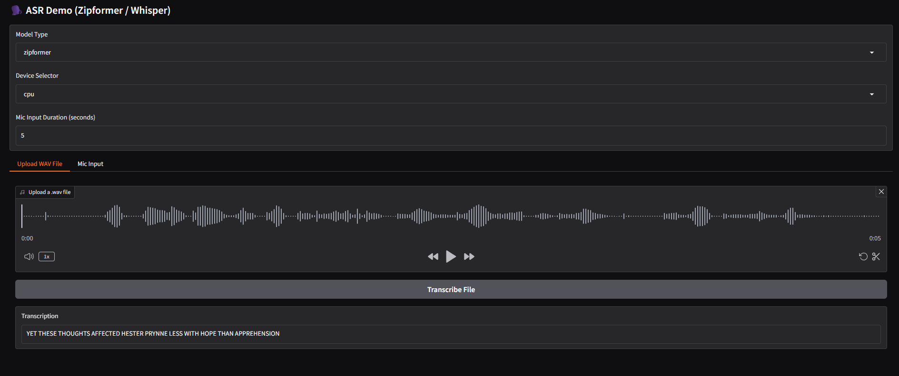

# LIRA

## Objective

This repository is ongoing work to build, track, and experiment with lightweight ASR (Automatic Speech Recognition) projects, focusing on efficient deployment and rapid prototyping using models optimized for Ryzen AI (RAI).
## Setup
This tool currently assumes that you have the latest RyzenAI SW installed along with the supporting NPU Driver. All instructions can be found https://ryzenai.docs.amd.com/en/latest/inst.html
```sh
conda activate ryzen-ai-1.5.0
git clone https://github.com/aigdat/LIRA.git
cd LIRA
pip install -e .
mkdir cache
```
## Lets Get Started

### 1. Models Available for Download
Here are the models currently available for use with this tool:

- **Whisper-Base**: [AMD-Whisper-Base](https://huggingface.co/aigdat/AMD-Whisper-Base)
- **Zipformer-English**: [AMD-zipformer-en](https://huggingface.co/aigdat/AMD-zipformer-en)
- **Zipformer-Bilingual**: [ASR_Chinese_test](https://huggingface.co/aigdat/ASR_Chinese_test)

### 2. Quick CLI Tool

The `run_asr` script provides a simple command-line interface for running ASR tasks. It supports both `zipformer` and `whisper` model architectures, using models from Hugging Face that are cached locally for speed. You can process audio from files or (experimentally) from a microphone.

**Example usage:**
```sh
run_asr --model-dir <HF Repo-id|path/to/local/model/dir> --input <audio.wav|mic> --duration <seconds> --model-type <zipformer|whisper> --device <cpu|npu>
```
Note:
- Ensure you have access to aigdat HF repo https://huggingface.co/aigdat if you need to download exported models
- If downloading and compiling for the first time, it takes ~15 minutes

### 3. Live Demo App[WIP]

A Gradio-based demo app is included for interactive ASR testing. You can upload a wave file, select your preferred model, and choose the target device. 
(Note: Microphone input is not yet supported in the demo.)




These tools enable fast experimentation and deployment of ASR models tailored for RAI.

```bash
(ryzen-ai-1.4.0ga) C:\Users\ISWAALEX\LIRA>python main.py

* Running on local URL:  http://127.0.0.1:7860
* To create a public link, set `share=True` in `launch()`.
```
